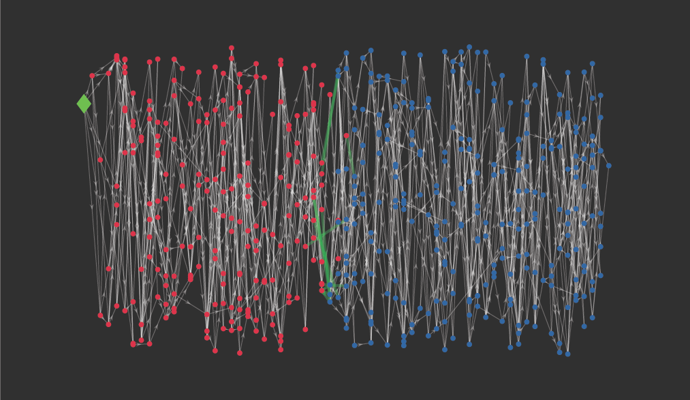
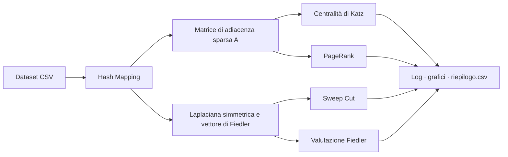
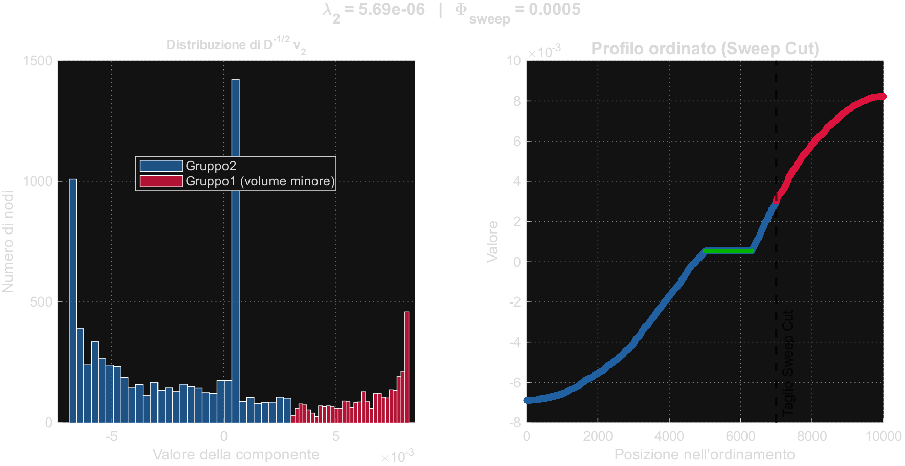
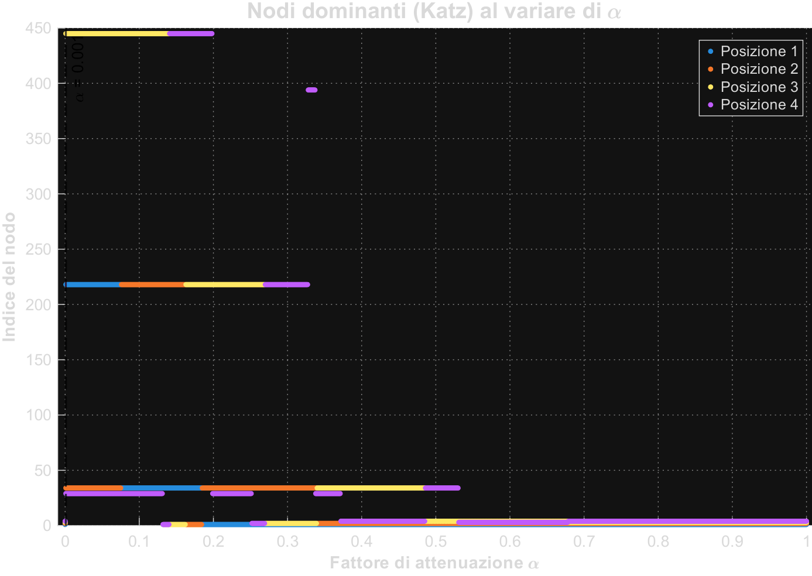
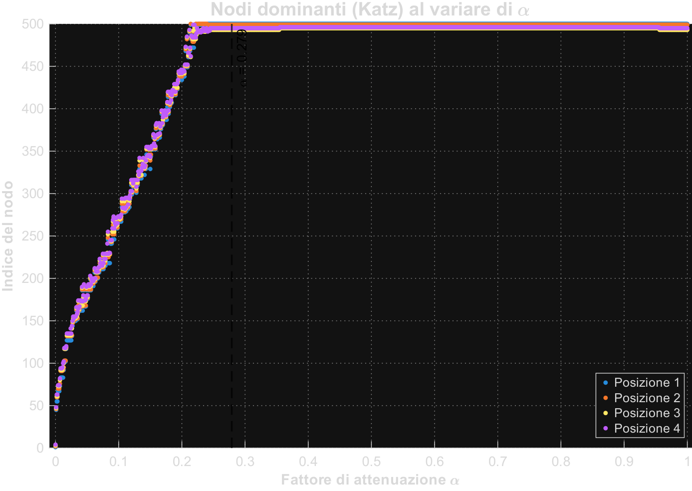

<div align="center">

# Analisi di stabilità nelle reti blockchain basate su DAG
### Stability Analysis of DAG-Based Blockchain Networks


Tesi di Laurea in Calcolo Numerico · *Bachelor's Thesis in Numerical Analysis*
Università degli Studi di Bari Aldo Moro · A.A. / A.Y. 2025–2026

**Andrea Martilotti** · Relatrice / *Supervisor*: Prof.ssa Antonella Falini

[🇮🇹 Italiano](#-italiano) · [🇬🇧 English](#-english)



<sub>Le prime 500 transazioni del Tangle generato, disposte per altezza topologica · <i>The first 500 transactions of the generated Tangle, arranged by topological height</i></sub>

</div>

---

## 🇮🇹 Italiano

### Abstract
Il lavoro studia la stabilità delle reti blockchain basate su DAG, come il Tangle del protocollo IOTA. Queste reti rappresentano un'alternativa alle blockchain lineari, eliminando i miner e le relative commissioni. La loro sicurezza dipende dalla struttura geometrica del grafo, che può essere alterata da attacchi volti a manipolare il consenso, come il *Parasite Chain*.

Il lavoro utilizza strumenti di algebra lineare numerica e di teoria spettrale, analizzando la stabilità su due livelli di astrazione. A livello **nodale** sono state analizzate la centralità di Katz e il PageRank; a livello **macroscopico** è stata studiata la coesione globale del grafo attraverso la Laplaciana normalizzata simmetrica, la connettività algebrica e l'autovettore di Fiedler, con l'algoritmo di Sweep Cut per l'individuazione dei colli di bottiglia. La pipeline è stata applicata a dataset fino a 10000 transazioni, generati con il supporto di modelli linguistici (LLM).

I risultati mostrano che il fattore di attenuazione di Katz segna il passaggio da un'importanza locale a una globale, e che in presenza di un attacco le transazioni iniziali dell'attaccante superano la genesi nelle classifiche. A livello spettrale lo Sweep Cut individua il collo di bottiglia di conduttanza minima, dovuto alla forma allungata del grafo, mentre il vettore di Fiedler evidenzia un tratto di valori pressoché costanti compatibile con il sottografo parassita.

### Pipeline


### Struttura della repository
```
├── stability_DAG_analisys.m   # pipeline MATLAB di analisi
├── generatore/final_version    # script Python di generazione dei dataset
├── dataset/
│   ├── healty/dataset_dag.csv  # Tangle sano (10000 transazioni)
│   └── parasite/dataset_dag.csv# Tangle con Parasite Chain (10000 transazioni)
├── pdf/                        # grafici, log di esecuzione, risultati .mat, riepilogo.csv
└── docs/img/                   # immagini del README
```

### Esecuzione
1. Apri `stability_DAG_analisys2.m` in MATLAB (R2021a o successivo, nessun toolbox aggiuntivo).
2. Imposta i parametri nella sezione 1:
   - `n` — numero di transazioni da analizzare (500, 2000, 10000);
   - `verso` — `2` per il verso *Backward* (tip → genesi, accumulo del consenso), `1` per il verso *Forward*;
   - `dataset` — percorso del file CSV.
3. Esegui lo script: log, grafici e risultati vengono salvati nella cartella `pdf/`, e `riepilogo.csv` riceve una riga per ogni esecuzione.


<p align="center">
<br>
<sub>Distribuzione e profilo ordinato del vettore di Fiedler nel dataset sotto attacco: in verde il tratto costante.</sub>
</p>

<p align="center">

<br>
<sub>Nodi dominanti di Katz al variare di α (500 transazioni): verso tip → genesi (sinistra) e genesi → tip (destra).</sub>
</p>

### Generazione dei dataset
I dataset sono sintetici e sono stati prodotti da uno script Python scritto con il supporto di modelli linguistici (Gemini 3.1 Pro e Claude Fable 5), combinando *role prompting*, *zero-shot prompting*, *multiagent debate* e *self-refine*. Il generatore implementa la Tip Selection MCMC con α = 0.15 e il modello di latenza di Popov (λ = 1, h = 6), con seme fisso per la riproducibilità. I dettagli sono descritti nei capitoli 5 e 6 della tesi.

---

## 🇬🇧 English

### Abstract
This work studies the stability of DAG-based blockchain networks, such as the Tangle of the IOTA protocol. These networks are an alternative to linear blockchains, removing miners and the related fees. Their security depends on the geometric structure of the graph, which can be altered by attacks aimed at manipulating consensus, such as the *Parasite Chain*.

The work relies on tools from numerical linear algebra and spectral graph theory, analysing stability at two levels of abstraction. At the **node level**, Katz centrality and PageRank were analysed; at the **macroscopic level**, the global cohesion of the graph was studied through the symmetric normalized Laplacian, the algebraic connectivity and the Fiedler vector, together with the Sweep Cut algorithm to identify bottlenecks. The pipeline was applied to datasets of up to 10,000 transactions, generated with the support of large language models (LLMs).

The results show that Katz's attenuation factor marks the transition from a local to a global notion of importance, and that under attack the attacker's initial transactions overtake the genesis in the rankings. At the spectral level, the Sweep Cut identifies the minimum-conductance bottleneck, caused by the elongated shape of the graph, while the Fiedler vector reveals a segment of nearly constant values compatible with the parasite subgraph.

### Repository structure
See the tree in the Italian section: the MATLAB pipeline, the Python dataset generator, the healthy and attacked datasets, and the `pdf/` folder with plots, execution logs, `.mat` results and `riepilogo.csv`.

### How to run
1. Open `stability_DAG_analisys2.m` in MATLAB (R2021a or later, no extra toolboxes).
2. Set the parameters in section 1:
   - `n` — number of transactions to analyse (500, 2000, 10000);
   - `verso` — `2` for the *Backward* direction (tips → genesis, consensus accumulation), `1` for the *Forward* direction;
   - `dataset` — path to the CSV file.
3. Run the script: logs, plots and results are saved in `pdf/`, and `riepilogo.csv` gets one row per run.

### Dataset generation
The datasets are synthetic and were produced by a Python script written with the support of large language models (Gemini 3.1 Pro and Claude Fable 5), combining *role prompting*, *zero-shot prompting*, *multiagent debate* and *self-refine*. The generator implements MCMC Tip Selection with α = 0.15 and Popov's latency model (λ = 1, h = 6), with a fixed random seed for reproducibility. Details are given in chapters 5 and 6 of the thesis.

---

<div align="center">
<sub>© 2026 Andrea Martilotti · Università degli Studi di Bari Aldo Moro</sub>
</div>
